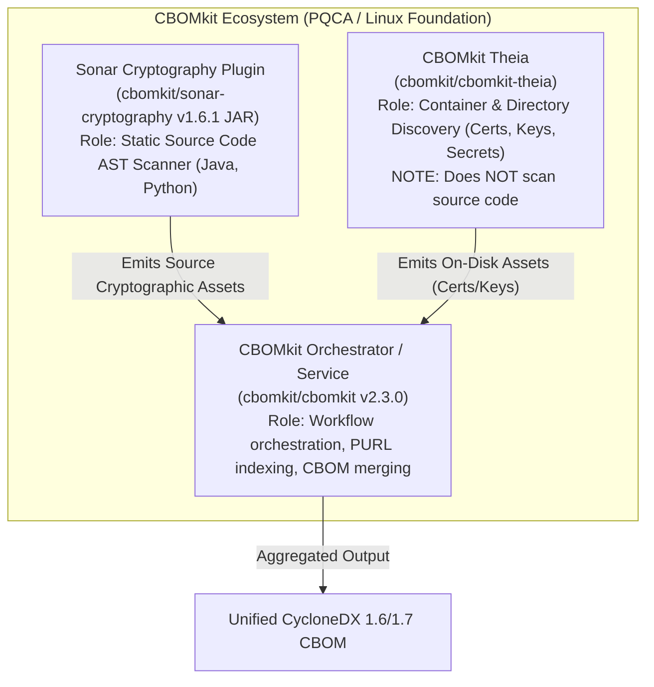

# Phase 1C-A — Controlled Tool Acquisition & Benchmark Environment Report

**Document Version:** 1.1.0 (Correction & Source-of-Truth Pass)  
**Phase:** Phase 1C-A (Controlled Tool Acquisition & Benchmark Environment)  
**Status:** COMPLETE WITH CORRECTIONS  
**Primary References:** [`OPEN_SOURCE_REGISTER.md`](./OPEN_SOURCE_REGISTER.md), [`PHASE_1C_ENVIRONMENT.md`](./PHASE_1C_ENVIRONMENT.md), [`HUMAN_REVIEW_CHECKLIST.md`](../benchmark/HUMAN_REVIEW_CHECKLIST.md)

---

## 1. Executive Summary & Phase Boundaries

Phase 1C-A establishes a controlled, verified, and sandboxed evaluation environment for analyzing candidate cryptographic discovery tools against the human-verified seed corpus (TC-01 through TC-11).

### Mandatory Governance Rules Observed:
* **Evaluation Only:** Zero scanner integration into the ECDAT core product. Zero production discovery code created.
* **Corpus & Ground Truth Immutability:** Benchmark seed fixtures in [`product/benchmark/corpus/seed/`](../benchmark/corpus/seed/) and human-verified answer keys in [`product/benchmark/answer_keys/`](../benchmark/answer_keys/) remain completely unaltered.
* **Evidence vs Ground Truth:** Scanner outputs are strictly treated as untrusted raw evidence. No scanner output has been adopted as ground truth.
* **Benchmark Scans Not Run:** No benchmark scans were executed against TC-01..TC-11 during this phase. Accuracy, recall, precision, and latency evaluation is strictly gated until Phase 1C-B.
* **Prerequisite Policy:** Host constraints are preserved without unauthorized system installs (no Docker daemon, no Go compiler, no local SonarQube server installed). Tools requiring missing runtimes are staged and labeled **"Acquired but execution dependency unavailable"**.

---

## 2. Candidate Tool Acquisition Summary Table

| Tool / Component | Official Source | Version / Tag | License | Input Scope | Output Formats | Acquisition Status | Checksum Provenance | Evaluation Role |
| :--- | :--- | :--- | :--- | :--- | :--- | :--- | :--- | :--- |
| **CryptoScan** | `csnp/cryptoscan` | **v1.4.0** (Release) | Apache-2.0 | Source code (Java, Python, Go, C/C++) | Custom JSON, SARIF, CycloneDX CBOM | **Acquired & Staged (Ready)** | Upstream `checksums.txt` & GitHub API asset digest | **Evaluation Candidate** |
| **pqaudit** | `PQCWorld/pqaudit` | **v0.5.0** (npm pkg / tag) | MIT | Source code, manifest lockfiles | CycloneDX CBOM JSON, SARIF, Text | **Acquired & Staged (Ready)** | Official npm package registry metadata (shasum & integrity) | **Evaluation Candidate** |
| **Sonar Cryptography Plugin** *(CBOMkit Ecosystem)* | `cbomkit/sonar-cryptography` | **v1.6.1 JAR** (Release 1.6.1 / tag 1.7.0) | Apache-2.0 | Java, Python source files | SonarQube Issues, CycloneDX CBOM | **Acquired but execution dependency unavailable** | GitHub API official release asset digest | **Evaluation Candidate** |
| **CBOMkit Orchestrator** *(CBOMkit Ecosystem)* | `cbomkit/cbomkit` | **2.3.0** (Official Release) | Apache-2.0 | Source trees, package manifests | CycloneDX CBOM JSON | **Inspected & Pinned (Source repo)** | GitHub API release metadata (source tarball only; no binary assets) | **Evaluation Candidate** |
| **CBOMkit Theia** *(CBOMkit Ecosystem)* | `cbomkit/cbomkit-theia` | Main branch / releases | Apache-2.0 | Filesystems, container images | CycloneDX CBOM JSON | **Inspected & Documented** | Upstream repository source; container execution blocked | **Evaluation Candidate (Container/FS Discovery)** |
| **Anchore Syft** | `anchore/syft` | **v1.51.1** (Release) | Apache-2.0 | Package manifests, lockfiles, filesystem | CycloneDX SBOM, SPDX JSON, Syft JSON | **Acquired & Staged (Ready)** | Upstream `syft_1.51.1_checksums.txt` & GitHub API digest | **Supplemental Candidate (Dependency SBOM only)** |
| **CodeQL CLI** | `github/codeql-cli-binaries` | **v2.27.0** (Release) | Proprietary / GitHub CodeQL Terms | Source code repositories (Java, Python, Go, C/C++) | SARIF, CSV, JSON, BQRS | **Version Pinned & Documented** | Official upstream `codeql-win64.zip.checksum.txt` | **Benchmark / Reference Only** *(Quarantined)* |
| **sslscan2** | `rbsec/sslscan` | **2.2.2** (Release) | GPL-3.0 (Copyleft) | Live TCP network endpoints (host:port) | XML, JSON, stdout | **Acquired & Staged (Ready)** | GitHub API official release asset digest | **Benchmark / Reference Only (Network-Layer)** *(Quarantined)* |
| **pqcscan** | `SaadBaig/pqcscan` | Commit `5d17208` | BSD-2-Clause | Live network SSH/TLS endpoints | Terminal stdout text | **Rejected / Blocked for Static Benchmark** | Evaluated from official source; rejected on scope | **Rejected (Scope Mismatch)** |

---

## 3. Source-Scope Matrix

The following matrix documents the verified capabilities of each candidate across discovery dimensions. Values are strictly constrained to: `YES`, `NO`, `LIMITED`, `BLOCKED`, or `NOT_EVALUATED`. No unverified capabilities are inferred.

| Tool / Component | Source Code | Dependencies | Directory / Filesystem | Container / Image | Network / TLS | Certificates / Keys | Primary Output | Evaluation Role |
| :--- | :---: | :---: | :---: | :---: | :---: | :---: | :--- | :--- |
| **CryptoScan** (v1.4.0) | **YES** | **LIMITED** | **YES** | **NO** | **NO** | **LIMITED** | JSON, SARIF, CBOM | Evaluation Candidate |
| **pqaudit** (v0.5.0) | **YES** | **YES** | **YES** | **NO** | **LIMITED** | **LIMITED** | CBOM JSON, SARIF | Evaluation Candidate |
| **Sonar Cryptography** (v1.6.1 JAR) | **YES** | **LIMITED** | **YES** | **NO** | **NO** | **LIMITED** | Sonar Issues, CBOM | Evaluation Candidate |
| **CBOMkit Orchestrator** (2.3.0) | **LIMITED** | **YES** | **YES** | **LIMITED** | **NO** | **NOT_EVALUATED** | CycloneDX CBOM | Evaluation Candidate |
| **CBOMkit Theia** | **NO** | **YES** | **YES** | **BLOCKED** | **NO** | **YES** | CycloneDX CBOM | Evaluation Candidate |
| **Anchore Syft** (v1.51.1) | **NO** | **YES** | **YES** | **YES** | **NO** | **NO** | CycloneDX SBOM, SPDX | Supplemental Candidate |
| **CodeQL CLI** (v2.27.0) | **YES** | **LIMITED** | **YES** | **NO** | **NO** | **LIMITED** | SARIF, CSV, JSON | Benchmark / Reference Only |
| **sslscan2** (2.2.2) | **NO** | **NO** | **NO** | **NO** | **YES** | **YES** | XML, JSON, stdout | Benchmark / Reference Only |
| **pqcscan** (SaadBaig) | **NO** | **NO** | **NO** | **NO** | **YES** | **NO** | Terminal stdout | Rejected (Scope Mismatch) |

### Scope Matrix Footnotes:
* **Source Code:** Indicates direct static code analysis of cryptographic calls in source files (Java, Python, Go, C/C++).
  - *CBOMkit Orchestrator* is marked `LIMITED` because it does not contain a native parser; it coordinates external language sensors (such as Sonar Cryptography).
  - *CBOMkit Theia* is marked **`NO`**: official upstream documentation explicitly states: `Discalimer: CBOMkit-theia does *not* perform source code scanning. Use sonar-cryptography for source code scanning.`
  - *Anchore Syft* is marked **`NO`**: Syft inspects package manifests and installed binary packages; it does not analyze cryptographic API calls inside application source files.
* **Dependencies:** Indicates discovery of declared library dependencies (e.g., BouncyCastle in `pom.xml`).
* **Container / Image:** *CBOMkit Theia* container image scanning is marked **`BLOCKED`** because the evaluation host lacks a running Docker daemon.
* **Network / TLS:** Indicates active socket probing of live network endpoints. *pqaudit* is marked `LIMITED` due to an experimental standalone socket prober in its repository.

---

## 4. Comprehensive Tool Evaluation Dossiers

### 4.1 CBOMkit Ecosystem Structure & Role Separation

CBOMkit is an ecosystem consisting of distinct, modular components with decoupled responsibilities:

#### A. CBOMkit Orchestrator (`cbomkit/cbomkit`)
1. **Official Repository:** `https://github.com/cbomkit/cbomkit` (Linux Foundation / Post-Quantum Cryptography Alliance).
2. **Version Verification & Status:**
   - **Official Published Release:** Tag **`2.3.0`** (ID: 385423939, target commitish: `release/2.3.0`, published `2026-09-09T10:32:56Z`).
   - Release `2.3.0` is an official published GitHub release, preceded by release `2.2.0` (published `2026-02-05T14:10:35Z`).
   - Release `2.3.0` publishes source archives (`tarball_url` and `zipball_url`) and contains zero prebuilt binary assets.
3. **Declared License:** Apache License 2.0 (`Apache-2.0`).
4. **Source URL:** `https://github.com/cbomkit/cbomkit`
5. **Acquisition Method:** Repository and release metadata inspected via GitHub REST API.
6. **Platform Requirements:** Java 17+ (Java `24.0.2` verified on host), Maven, Quarkus framework, PostgreSQL.
7. **Dependencies / Prerequisites:** Requires Quarkus service infrastructure and PostgreSQL backend.
8. **Supported Inputs:** Git repository URLs, filesystem directories, package URLs (PURLs).
9. **Primary Output:** Merged CycloneDX CBOM JSON (spec 1.6 / 1.7).
10. **Discovery Scope:** Service orchestration, language sensor coordination, and manifest indexing.
11. **Corpus Limitations (TC-01..TC-11):** Heavyweight service footprint; not suitable as a standalone CLI runner for unit benchmark calibration.
12. **Security Considerations:** Executes local parser subprocesses; enforces API boundaries.
13. **Evaluation Role:** **Evaluation Candidate (Orchestrator)**. Current execution status: *Inspected; execution dependency unavailable (requires full Quarkus/Postgres service environment).*

#### B. Sonar Cryptography Plugin (`cbomkit/sonar-cryptography`)
1. **Official Repository:** `https://github.com/cbomkit/sonar-cryptography`
2. **Version Verification & Status:**
   - **Latest Repository Tag / Release:** Release **`1.7.0`** (published `2026-09-01T09:25:23Z`). Note: Release `1.7.0` contains no prebuilt binary assets in its GitHub release.
   - **Latest Official Prebuilt Binary Asset:** **`sonar-cryptography-plugin-1.6.1.jar`** (attached to official release **`1.6.1`**, published `2026-07-13T13:33:15Z`, size: 51,302,861 bytes).
3. **Declared License:** Apache License 2.0 (`Apache-2.0`).
4. **Source URL:** `https://github.com/cbomkit/sonar-cryptography/releases/download/1.6.1/sonar-cryptography-plugin-1.6.1.jar`
5. **Acquisition Method:** Downloaded prebuilt JAR into `product/benchmark/tools/candidates/sonar-cryptography-plugin-1.6.1.jar`.
6. **Checksum & Provenance:**
   - Calculated SHA-256: `de2f21ea06740441e81ecae03b2e3ac743b79dcf87e5a6563c99989a8ba03b33`
   - Provenance: **GitHub API official release asset digest metadata** on release `1.6.1` (Match: TRUE).
7. **Platform Requirements:** Java 17+ (Java `24.0.2` verified on host).
8. **Dependencies / Prerequisites:** Requires SonarQube Server (v10.x/v25.x) or standalone SonarScanner CLI.
9. **Supported Inputs:** Java and Python source code files.
10. **Discovery Scope:** **Deep Static Source Code AST Analysis.** Symbol table and call-graph inspection for JCA, BouncyCastle, and PyCA Cryptography.
11. **Corpus Limitations (TC-01..TC-11):** Strong detection on JCA (TC-01..TC-04, TC-07); wrapper resolution (TC-08) requires cross-file symbol resolution.
12. **Security Considerations:** Runs within JVM sandbox; no arbitrary code execution.
13. **Evaluation Role:** **Evaluation Candidate (Primary Java Source Scanner)**. Current execution status: *Acquired but execution dependency unavailable (requires SonarScanner CLI / SonarQube runner on host).*

#### C. CBOMkit Theia (`cbomkit/cbomkit-theia`)
1. **Official Repository:** `https://github.com/cbomkit/cbomkit-theia`
2. **Version Verification & Status:** Main development branch / tagged releases.
3. **Declared License:** Apache License 2.0 (`Apache-2.0`).
4. **Source URL:** `https://github.com/cbomkit/cbomkit-theia`
5. **Acquisition Method:** Inspected official repository and upstream documentation.
6. **Platform Requirements:** Linux container environment (Docker / Podman) or Go build environment.
7. **Dependencies / Prerequisites:** Docker daemon (MISSING on evaluation host).
8. **Supported Inputs:** Filesystem directories, local Docker daemon images, OCI TAR archives, Dockerfiles.
9. **Primary Output:** Enriched CycloneDX CBOM JSON to stdout/console.
10. **Discovery Scope & Official Boundary:**
   - **DOES NOT SCAN SOURCE CODE.** Upstream README explicitly states:  
     `--> Disclaimer: CBOMkit-theia does *not* perform source code scanning <--`  
     `--> Use https://github.com/cbomkit/sonar-cryptography for source code scanning <--`
   - **Supported Discovery Scope:** Scans directories and container images for:
     - Certificate files (x.509 certificates)
     - Key files (PEM, DER, keystores)
     - Hardcoded secrets
     - Verifies executability of Java crypto assets via `javasecurity` plugin against system configuration.
11. **Corpus Limitations (TC-01..TC-11):** Incapable of scanning Java/Python code fixtures; cannot detect algorithms in `DynamicCipherService.java` or `AesGcmCipher.java`.
12. **Security Considerations:**
   - **CRITICAL ADVISORY:** Performs filesystem reads based on input; potential file-content leakage to stderr; untrusted container layers require strict sandbox boundary.
13. **Evaluation Role:** **Evaluation Candidate (Directory/Container/Keystore Discovery)**. Current execution status: *Inspected; container execution BLOCKED due to absence of Docker daemon on host.*

---

### 4.2 CryptoScan (`csnp/cryptoscan`)
1. **Official Repository:** `https://github.com/csnp/cryptoscan` (QRAMM Toolkit / Cybersecurity Non-Profit).
2. **Version Verification & Status:** Pinned at official release **`v1.4.0`** (published `2026-07-28T18:44:10Z`; commit `27c88b9`).
3. **Declared License:** Apache License 2.0 (`Apache-2.0`).
4. **Source URL:** `https://github.com/csnp/cryptoscan/releases/download/v1.4.0/cryptoscan_1.4.0_windows_amd64.zip`
5. **Acquisition Method:** Downloaded precompiled Windows amd64 binary zip into `product/benchmark/tools/candidates/` and unpacked to `product/benchmark/tools/verified/cryptoscan/`.
6. **Artifact Filename & Checksum Provenance:**
   - Artifact: `cryptoscan_1.4.0_windows_amd64.zip` (unpacked executable: `cryptoscan.exe`, 1,454,682 bytes).
   - Calculated SHA-256: `7a895fc2be2d3dc59ce62295e9e20b33c8cfa31e934c1ba4f30a491efab583c4`
   - Provenance: **Official upstream `checksums.txt` file** at `https://github.com/csnp/cryptoscan/releases/download/v1.4.0/checksums.txt` (Line 17) and confirmed by GitHub API release asset digest (Match: TRUE).
7. **Platform Requirements:** Windows x86_64, Linux, macOS.
8. **Dependencies / Prerequisites:** None. Standalone static Go binary.
9. **Supported Inputs:** Source files and directories (Java, Python, Go, C, C++).
10. **Output Formats:** Custom JSON, SARIF 2.1.0 (`--format sarif`), CycloneDX 1.6 CBOM (`--format cbom`).
11. **Discovery Scope:** Static source code AST analysis and cryptographic API invocation detection.
12. **Corpus Limitations (TC-01..TC-11):**
   - Word-boundary matching: does not match compound identifiers (e.g., `RSAPrivateKey`).
   - Dynamic resolution (TC-11): cannot infer runtime variables.
   - Docs directory suppression bug: paths containing `docs` suppress scanning.
13. **Security Considerations:** Offline local execution; zero outbound telemetry; read-only access.
14. **Evaluation Role:** **Evaluation Candidate (Primary Multi-Language Source Scanner)**. Current execution status: *Acquired & Staged (Ready for benchmark execution).*

---

### 4.3 pqaudit (`PQCWorld/pqaudit`)
1. **Official Repository:** `https://github.com/PQCWorld/pqaudit` (Homepage: `https://pqcworld.com`).
2. **Version Verification & Status:**
   - **npm Package Registry:** `pqaudit@0.5.0` (published by `pqcworld <info@pqcworld.com>`).
   - **GitHub Repository Tag:** Tag **`v0.5.0`** (commit `5e389b26c5699045b143f0b7c2a4dd483f113fb1`, published `2026-04-07T03:09:04Z`). Note: The GitHub release contains empty release assets (`assets: []`); the distributed artifact is published via the npm package registry.
3. **Declared License:** MIT License (`MIT`).
4. **Source URL:** `https://registry.npmjs.org/pqaudit/-/pqaudit-0.5.0.tgz`
5. **Acquisition Method:** Downloaded official npm registry tarball into `product/benchmark/tools/candidates/` and extracted to `product/benchmark/tools/verified/pqaudit/`.
6. **Artifact Filename & Checksum Provenance:**
   - Artifact: `pqaudit-0.5.0.tgz` (extracted unpacked size: 3.5 MB, containing WebAssembly Tree-sitter grammars).
   - Calculated SHA-1: `57b47a6615a0f19c8ce92c140382ad0561012e8c`
   - Calculated SHA-512: `sha512-2UoYghtiWhJ7abgMeL72OuhNuqZreBLuBkh3/ilOOWVGVVZ1GZEdKRbHmrC6t+6MQDZb4q29XnBFYP+OQUhWCg==`
   - Provenance: **Official npm package registry metadata** (`npm info pqaudit` distribution metadata `.shasum` and `.integrity`). Match: TRUE.
7. **Platform Requirements:** Cross-platform Node.js 18+ (Node `v24.15.0` verified on host).
8. **Dependencies / Prerequisites:** Node.js runtime. Unpacked distribution includes precompiled WASM grammars (`tree-sitter-java.wasm`, `tree-sitter-python.wasm`, `tree-sitter-typescript.wasm`).
9. **Supported Inputs:** Source code directories, package lockfiles (`pom.xml`, `package-lock.json`).
10. **Output Formats:** CycloneDX CBOM JSON, SARIF, Text/Markdown report, HTML report.
11. **Discovery Scope:** Static source code AST analysis (Tree-sitter WASM) targeting quantum-vulnerable cryptography (RSA, ECDSA, Ed25519, ECDH).
12. **Corpus Limitations & Governance Invariant:**
   - **MANDATORY GOVERNANCE RULE:** pqaudit's quantum vulnerability classifications, severity ratings, and migration recommendations are scanner evidence and MUST NOT be adopted as ECDAT's authoritative risk model.
   - Ignores symmetric algorithms (AES, DES) unless explicitly configured.
13. **Security Considerations:** Executes WebAssembly inside Node.js V8 sandbox; offline invocation required.
14. **Evaluation Role:** **Evaluation Candidate (PQC-Specific Source Scanner)**. Current execution status: *Acquired & Staged (Ready for benchmark execution via Node v24).*

---

### 4.4 pqcscan (`SaadBaig/pqcscan`)
1. **Official Repository Evaluated:** `https://github.com/SaadBaig/pqcscan` (Author: Saad Baig / Anvil Secure).
2. **Version / Commit:** Commit `5d17208` (Pushed `2026-06-25T10:48:14Z`, size: 7,600 KB).
3. **Declared License:** BSD 2-Clause "Simplified" License (`BSD-2-Clause`).
4. **Source URL:** `https://github.com/SaadBaig/pqcscan`
5. **Acquisition Status:** Evaluated from repository source; rejected on scope criteria.
6. **Platform Requirements:** Rust toolchain.
7. **Supported Inputs:** Network host and port strings (`<host>:<port>`).
8. **Primary Output:** Terminal stdout.
9. **Discovery Scope & Rejection Rationale:**
   - **CRITICAL SCOPE MISMATCH:** `SaadBaig/pqcscan` is an active network scanner that tests remote SSH/TLS server handshakes for Post-Quantum Cryptography algorithm support (e.g., hybrid Kyber key exchange).
   - It possesses **ZERO capability to scan source code files** (Java, Python, Go, C/C++).
   - It cannot parse ASTs, cannot inspect source code repositories, and cannot generate software CBOMs.
10. **Corpus Applicability (TC-01..TC-11):** Zero applicability. Cannot scan any fixture in the seed corpus.
11. **Evaluation Role:** **REJECTED / BLOCKED for Static Code Benchmark.** Scope mismatch formally documented.

---

### 4.5 Anchore Syft (`anchore/syft`)
1. **Official Repository:** `https://github.com/anchore/syft`
2. **Version Verification & Status:** Pinned at official release **`v1.51.1`** (published `2026-08-27T17:01:15Z`).
3. **Declared License:** Apache License 2.0 (`Apache-2.0`).
4. **Source URL:** `https://github.com/anchore/syft/releases/download/v1.51.1/syft_1.51.1_windows_amd64.zip`
5. **Acquisition Method:** Downloaded precompiled Windows amd64 zip into `product/benchmark/tools/candidates/` and unpacked to `product/benchmark/tools/verified/syft/`.
6. **Artifact Filename & Checksum Provenance:**
   - Artifact: `syft_1.51.1_windows_amd64.zip` (unpacked executable: `syft.exe`, 89,428,480 bytes).
   - Calculated SHA-256: `5e4bc3e6b6344b4625de0f7aa5351aaa72856d11d78462972de0a101ee2c1c8f`
   - Provenance: **Official upstream `syft_1.51.1_checksums.txt` file** at `https://github.com/anchore/syft/releases/download/v1.51.1/syft_1.51.1_checksums.txt` (Line 34) and confirmed by GitHub API release asset digest (Match: TRUE).
7. **Platform Requirements:** Windows x86_64, Linux, macOS.
8. **Dependencies / Prerequisites:** Standalone static executable.
9. **Supported Inputs:** Package manifests (`pom.xml`, `package.json`, `go.mod`), container images, filesystems.
10. **Output Formats:** CycloneDX SBOM JSON, SPDX JSON, Syft JSON, table.
11. **Discovery Scope & Role Distinction:**
   - **DOES NOT PERFORM CRYPTOGRAPHIC ALGORITHM DISCOVERY IN CODE.**
   - Generates Software Bill of Materials (SBOM) cataloging third-party package dependencies.
12. **Corpus Applicability (TC-01..TC-11):** Relevant strictly to TC-09 (Dependency-only BouncyCastle declaration in `pom.xml`).
13. **Evaluation Role:** **Supplemental Candidate (Dependency/Component Discovery Only).** Preserved as a dependency baseline, not a primary crypto scanner. Current execution status: *Acquired & Staged (Ready).*

---

### 4.6 CodeQL CLI (`github/codeql-cli-binaries`)
1. **Official Repository:** `https://github.com/github/codeql-cli-binaries` / query packs at `github/codeql`.
2. **Version Verification & Status:** Pinned at official release **`v2.27.0`** (published `2026-09-09T11:55:00Z`).
3. **Declared License:** **Proprietary / GitHub CodeQL Terms and Conditions** (Queries are MIT; CLI analysis engine is proprietary).
4. **Source URL:** `https://github.com/github/codeql-cli-binaries/releases/download/v2.27.0/codeql-win64.zip`
5. **Artifact Filename & Checksum Provenance:**
   - Target Artifact: `codeql-win64.zip` (415,831,868 bytes).
   - Expected SHA-256: `0320fd9070c3582b09805d9ac82211816a580edec695c5b2baf52fcc51d658d5`
   - Provenance: **Official upstream `codeql-win64.zip.checksum.txt` release asset** and GitHub API release digest metadata.
6. **Platform Requirements:** Windows x86_64, Linux, macOS; Java 17+.
7. **Dependencies / Prerequisites:** Language build tools (javac, maven, go) for compiled language database extraction.
8. **Supported Inputs:** Complete source code repositories with build environments.
9. **Output Formats:** SARIF 2.1.0, BQRS, CSV, JSON.
10. **Licensing Isolation Invariant:**
   - **STRICT QUARANTINE:** CodeQL CLI engine is governed by GitHub Terms. It must NEVER be embedded, bundled, or integrated into the ECDAT core product.
   - Pinned exclusively as an authoritative **benchmark-reference baseline** for evaluating query accuracy on open-source fixtures.
11. **Acquisition Status:** Version pinned and documented; local bundle ingestion deferred to prevent repository bloat.
12. **Evaluation Role:** **Benchmark / Reference Only.** Zero production integration eligibility.

---

### 4.7 sslscan2 (`rbsec/sslscan`)
1. **Official Repository:** `https://github.com/rbsec/sslscan`
2. **Version Verification & Status:** Pinned at official release **`2.2.2`** (published `2026-03-30T18:39:20Z`).
3. **Declared License:** **GNU General Public License v3.0 (`GPL-3.0`)** — Strong Copyleft.
4. **Source URL:** `https://github.com/rbsec/sslscan/releases/download/2.2.2/sslscan-2.2.2.zip`
5. **Acquisition Method:** Downloaded precompiled Windows MinGW zip into `product/benchmark/tools/candidates/` and unpacked to `product/benchmark/tools/verified/sslscan/`.
6. **Artifact Filename & Checksum Provenance:**
   - Artifact: `sslscan-2.2.2.zip` (unpacked executable: `sslscan.exe`, 6,849,038 bytes, with bundled OpenSSL 3.5.4 DLLs).
   - Calculated SHA-256: `41082661e15baad7fdbf9c750910576cbf9b642d47435fa1dd4fa8d920e439b3`
   - Provenance: **GitHub API official release asset digest metadata** on release `2.2.2` (Match: TRUE).
7. **Platform Requirements:** Windows (standalone MinGW binary), Linux, macOS.
8. **Dependencies / Prerequisites:** Network socket access to target TLS service.
9. **Supported Inputs:** Network targets (`host:port`).
10. **Licensing Isolation Invariant:**
   - **STRICT QUARANTINE:** Governed by GPL-3.0. Embedding or statically linking `sslscan` into ECDAT core would impose GPL-3.0 copyleft obligations across the entire codebase.
   - Strictly quarantined in `product/benchmark/tools/verified/sslscan/`.
11. **Corpus Applicability (TC-01..TC-11):** Zero applicability to static source code fixtures; relevant only to live network TLS services.
12. **Evaluation Role:** **Benchmark / Reference Only (Network-Layer Discovery).** Zero production core embedding eligibility. Current execution status: *Acquired & Staged (Ready for external reference).*

---

## 5. Exact Inventory of Installed vs Staged vs Blocked Artifacts

### A. Tools Successfully Acquired & Staged in Evaluation Workspace:
1. **`csnp/cryptoscan` v1.4.0 (Windows amd64):**
   - Candidate: `product/benchmark/tools/candidates/cryptoscan_1.4.0_windows_amd64.zip`
   - Checksum: `SHA256: 7a895fc2be2d3dc59ce62295e9e20b33c8cfa31e934c1ba4f30a491efab583c4` (Verified against upstream `checksums.txt`)
   - Staged Binary: `product/benchmark/tools/verified/cryptoscan/cryptoscan.exe`
   - Status: **Acquired & Staged (Ready for benchmark execution)**
2. **`PQCWorld/pqaudit` v0.5.0 (Node/WASM Package):**
   - Candidate: `product/benchmark/tools/candidates/pqaudit-0.5.0.tgz`
   - Checksum: `SHA1: 57b47a6615a0f19c8ce92c140382ad0561012e8c` / `SHA512: 2UoYghtiWhJ7abgMeL72OuhNuqZreBLuBkh3/ilOOWVGVVZ1GZEdKRbHmrC6t+6MQDZb4q29XnBFYP+OQUhWCg==` (Verified against npm package registry metadata)
   - Staged CLI: `product/benchmark/tools/verified/pqaudit/package/dist/` (includes WASM Tree-sitter parsers)
   - Status: **Acquired & Staged (Ready for benchmark execution via Node v24)**
3. **`anchore/syft` v1.51.1 (Windows amd64):**
   - Candidate: `product/benchmark/tools/candidates/syft_1.51.1_windows_amd64.zip`
   - Checksum: `SHA256: 5e4bc3e6b6344b4625de0f7aa5351aaa72856d11d78462972de0a101ee2c1c8f` (Verified against upstream `syft_1.51.1_checksums.txt`)
   - Staged Binary: `product/benchmark/tools/verified/syft/syft.exe`
   - Status: **Acquired & Staged (Ready for supplemental dependency benchmark)**
4. **`rbsec/sslscan` v2.2.2 (Windows MinGW binary):**
   - Candidate: `product/benchmark/tools/candidates/sslscan-2.2.2.zip`
   - Checksum: `SHA256: 41082661e15baad7fdbf9c750910576cbf9b642d47435fa1dd4fa8d920e439b3` (Verified against GitHub API release asset digest)
   - Staged Binary: `product/benchmark/tools/verified/sslscan/sslscan.exe`
   - Status: **Acquired & Staged (Benchmark / Reference Only)**
5. **`cbomkit/sonar-cryptography` v1.6.1 JAR:**
   - Candidate: `product/benchmark/tools/candidates/sonar-cryptography-plugin-1.6.1.jar` (51,302,861 bytes)
   - Checksum: `SHA256: de2f21ea06740441e81ecae03b2e3ac743b79dcf87e5a6563c99989a8ba03b33` (Verified against GitHub API release asset digest on release 1.6.1)
   - Status: **Acquired but execution dependency unavailable (requires SonarQube server or SonarScanner CLI runner)**

### B. Tools Blocked or Not Ingested Locally:
1. **`SaadBaig/pqcscan`:** **REJECTED / BLOCKED** on scope mismatch (active network SSH/TLS scanner only; cannot scan static code).
2. **`cbomkit/cbomkit-theia`:** **BLOCKED** for containerized execution due to missing Docker daemon on host; noted for filesystem/keystore discovery only (no source scanning).
3. **`cbomkit/cbomkit` Orchestrator (v2.3.0):** Inspected and release verified; execution deferred (requires full Quarkus/Postgres service environment).
4. **`github/codeql-cli-binaries` (v2.27.0):** Pinned as external benchmark-reference baseline; full 415 MB bundle deferred from local directory ingestion to prevent workspace bloat.
5. **Production Core Product:** ZERO discovery code or scanner adapters were created or installed in `product/core/`.
