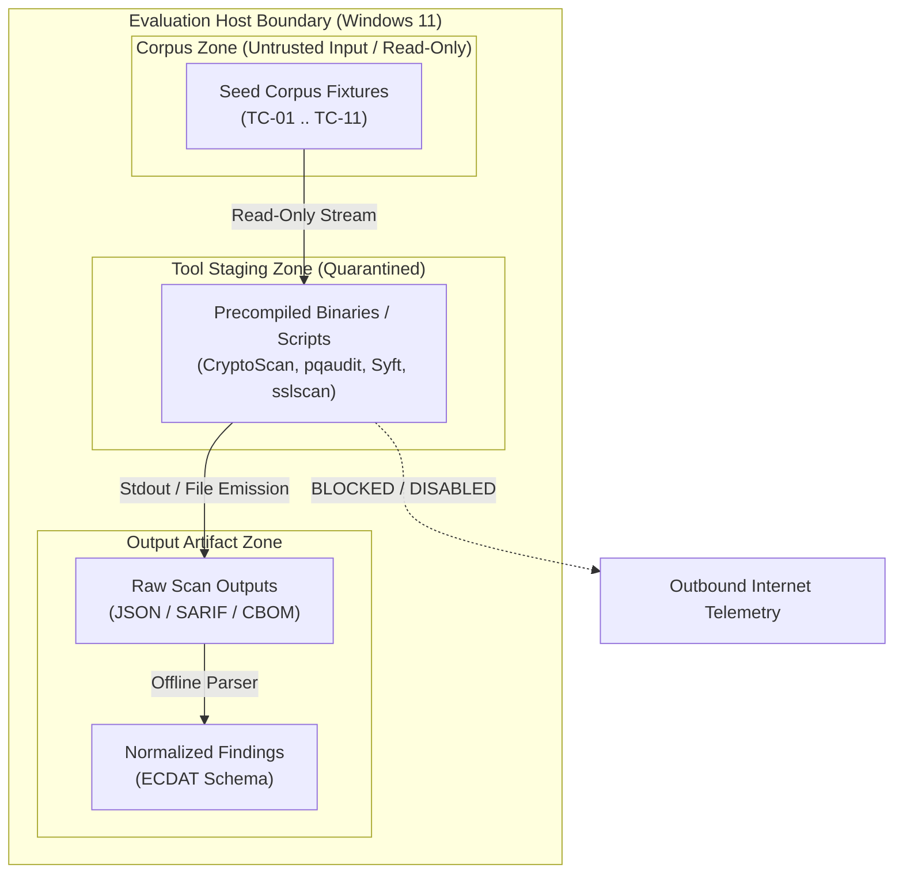

# Phase 1C-A — Controlled Benchmark Evaluation Environment

**Document Version:** 1.0.0  
**Phase:** Phase 1C-A (Controlled Tool Acquisition & Benchmark Environment)  
**Status:** ACTIVE / ENFORCED  
**Security Classification:** Controlled Engineering Isolation  
**Primary Reference:** [`PROJECT_SPEC.md`](./PROJECT_SPEC.md), [`SECURITY_MODEL.md`](./SECURITY_MODEL.md), [`OPEN_SOURCE_REGISTER.md`](./OPEN_SOURCE_REGISTER.md)

---

## 1. Objectives & Environmental Boundaries

Phase 1C-A establishes an isolated, reproducible, and strictly controlled evaluation workspace for analyzing candidate cryptographic discovery tools against the human-verified seed benchmark corpus (`product/benchmark/corpus/seed/`, TC-01 through TC-11).

### Mandatory Environmental Invariants
1. **Zero Production Contamination:** Third-party tool binaries, source code, node packages, jar files, and temporary outputs must NEVER be placed in `product/core/` or `product/src/`. All evaluation tooling resides strictly in `product/benchmark/tools/`.
2. **Ground Truth Immutability:** Benchmark seed fixtures (`product/benchmark/corpus/seed/`), answer keys (`product/benchmark/answer_keys/`), schemas, and human review records (`HUMAN_REVIEW_CHECKLIST.md`) must NOT be modified.
3. **Untrusted Input Policy:** All scanned fixtures are treated as untrusted data. Tool execution must never execute, interpret, compile, or dynamically run seed corpus files.
4. **Network Quarantine:** Scanning must operate strictly offline or with outbound network access blocked to ensure sensitive scanned source code is never transmitted to external telemetry or cloud analytics.
5. **Evaluation Only:** Tool presence in this environment does NOT constitute selection or integration into the ECDAT core product. Integration decisions are blocked pending Phase 1C empirical benchmark results.

---

## 2. Host Operating Environment & Runtime Inventory

The benchmark environment was inspected and verified on the local host system:

| Environmental Component | Specification / Version | Status / Constraints |
| :--- | :--- | :--- |
| **Operating System** | Windows 11 Enterprise (64-bit, x86_64) | Active Host OS |
| **Primary Shell** | PowerShell (v5.1 / Core) | Native execution environment |
| **Java Runtime** | Java(TM) SE Runtime Environment `24.0.2` (build 24.0.2+12-54) | Available; supports Java 17+ tooling (Sonar plugin / CBOMkit) |
| **Node.js Runtime** | Node.js `v24.15.0` | Available; supports TypeScript/Node CLI tools (`pqaudit`) |
| **Python Runtime** | Python `3.12.4` (amd64) | Available; supports benchmark harness scripting |
| **Git Version** | Git `2.54.0.windows.1` | Available; supports pinned tag verification |
| **Go Compiler** | *Not installed on host* | Precompiled standalone Go binaries used (`cryptoscan`, `syft`) |
| **Docker Daemon** | *Not installed on host* | Containerized runners blocked; native CLI execution mandated |

### Critical Environmental Constraint: Containerless Execution
Because Docker is not installed on the evaluation host:
* Container-dependent tools (e.g., containerized SonarQube instances, containerized `cbomkit-theia`) cannot be launched via Docker Compose.
* Any tool evaluated on this host must run either:
  1. As a native Windows standalone binary (e.g., `cryptoscan.exe`, `syft.exe`, `sslscan.exe`).
  2. As a Node.js CLI script via native Node `v24.15.0` (e.g., `pqaudit`).
  3. As a Java application/plugin via native Java `24.0.2` using standalone SonarScanner CLI or Quarkus runner.

---

## 3. Directory Layout & Isolation Architecture

The evaluation area is isolated in `product/benchmark/tools/`:

```text
product/
└── benchmark/
    ├── corpus/
    │   └── seed/                  # [READ-ONLY] TC-01..TC-11 Ground-Truth Seed Corpus
    ├── answer_keys/               # [READ-ONLY] Human-Verified Benchmark Answer Keys
    ├── schemas/                   # [READ-ONLY] Evidence & Finding JSON Schemas
    └── tools/                     # [ISOLATED BENCHMARK WORKSPACE]
        ├── README.md              # Governance and isolation directive
        ├── candidates/            # Downloaded, pinned candidate archives & JARs
        │   ├── cryptoscan_1.4.0_windows_amd64.zip
        │   ├── syft_1.51.1_windows_amd64.zip
        │   ├── sonar-cryptography-plugin-1.6.1.jar
        │   ├── pqaudit-0.5.0.tgz
        │   └── sslscan-2.2.2.zip
        ├── verified/              # Unpacked and checksum-verified binaries/scripts
        │   ├── cryptoscan/        # Unpacked cryptoscan.exe (v1.4.0)
        │   ├── syft/              # Unpacked syft.exe (v1.51.1)
        │   ├── pqaudit/           # Unpacked pqaudit CLI (v0.5.0)
        │   └── sslscan/           # Unpacked sslscan.exe (v2.2.2)
        ├── runs/                  # Execution runner configurations and run scripts
        ├── raw_outputs/           # Original, unedited tool scan outputs
        ├── normalized_outputs/    # Schema-conforming normalized findings
        └── reports/               # Benchmark accuracy & comparative scorecards
```

---

## 4. Security Policy & Trust Boundaries



### Trust Boundary Invariants
1. **Input Isolation:** The candidate tool receives read-only filesystem paths to `product/benchmark/corpus/seed/<fixture_dir>/`. Write operations into corpus directories are denied.
2. **Execution Sandboxing:** Subprocesses are invoked with specific arguments, working directories restricted to `product/benchmark/tools/runs/`, and standard output redirected to `raw_outputs/`.
3. **No Execution of Scanned Binaries:** Tools must parse files statically (AST, pattern matching, header analysis). Under no circumstance may a tool load or execute target classes or native binaries from the test cases.
4. **Quarantine of GPL-3.0 & Proprietary Candidates:** `sslscan2` (GPL-3.0) and `CodeQL` (GitHub Terms) are strictly designated as benchmark-reference candidates. They are quarantined from any production bundling.

---

## 5. Checksum Verification Protocol

Every downloaded asset must have its cryptographic hash validated against official project release manifests before execution staging:

```powershell
# SHA-256 Checksum Validation Command
Get-FileHash -Path <CandidatePath> -Algorithm SHA256
```

Assets with mismatched hashes must be deleted immediately, and the incident logged in the acquisition report.
