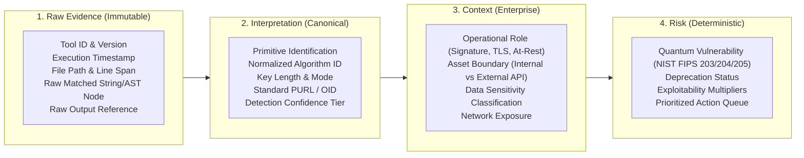
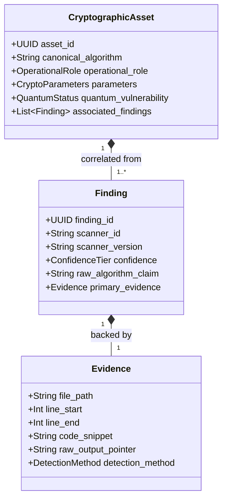
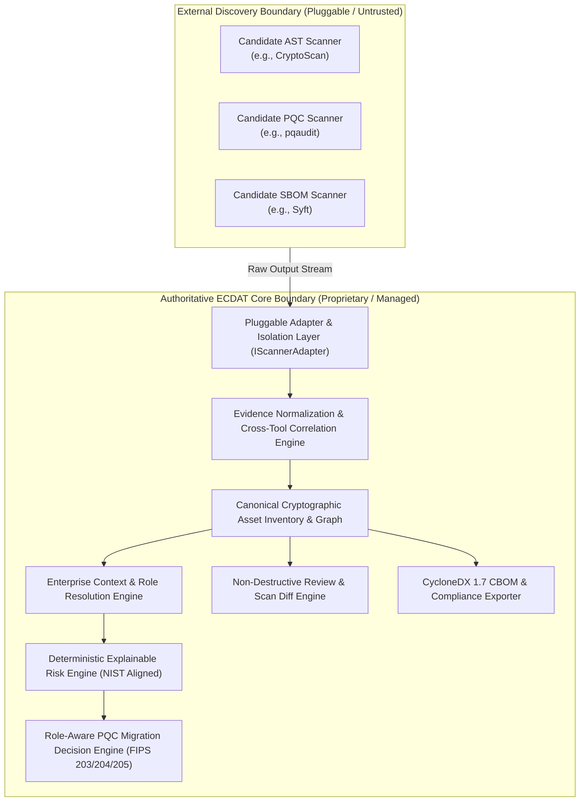
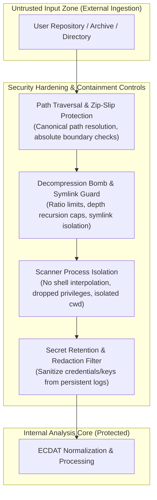
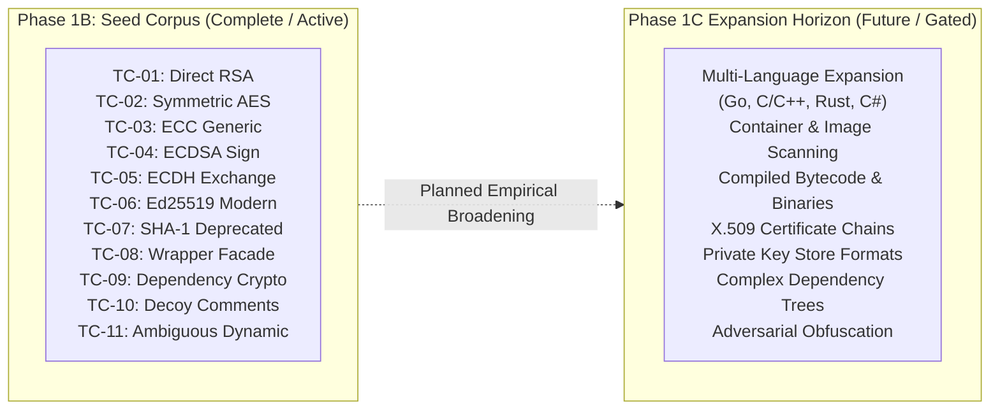

# Pre-Phase 1C-B Architecture & Evaluation Gate

**Document Version:** 1.0.0  
**Phase Status:** Phase 1C-A Complete with Corrections | Pre-1C-B Gate: CREATED / PENDING REVIEW | Phase 1C-B: GATED / NOT STARTED  
**Security Classification:** Controlled Engineering Isolation — Architecture Governance  
**Governance Directive:** Strict evaluation gating. No benchmark execution, scanner integration, or production implementation authorized without explicit review.  
**Primary References:** [`PROJECT_SPEC.md`](./PROJECT_SPEC.md), [`ARCHITECTURE.md`](./ARCHITECTURE.md), [`SECURITY_MODEL.md`](./SECURITY_MODEL.md), [`OPEN_SOURCE_REGISTER.md`](./OPEN_SOURCE_REGISTER.md), [`PHASE_1C_ENVIRONMENT.md`](./PHASE_1C_ENVIRONMENT.md), [`PHASE_1C_ACQUISITION_REPORT.md`](./PHASE_1C_ACQUISITION_REPORT.md).

---

## A. Gate Purpose

This Architecture & Evaluation Gate establishes a formal pre-execution checkpoint prior to launching Phase 1C-B (Benchmark Harness Execution & Evaluation). 

### 1. Rationale for the Gate
In open-source software integration and security tool engineering, a common structural failure mode is selecting external tools based on surface-level claims, marketing language, GitHub star counts, or superficial format compliance (such as merely emitting JSON or claiming CBOM support). When tools are integrated into core architectures prematurely:
* Underlying parsing gaps, false-positive explosions, and brittle heuristics are inherited directly into production logic.
* Core data schemas become tightly coupled to idiosyncratic scanner representations rather than authoritative domain abstractions.
* Licensing encumbrances (e.g., viral copyleft GPL or restrictive commercial terms) may inadvertently contaminate enterprise delivery artifacts.
* Operational fragility (such as unhandled parser panics, severe memory bloat, or excessive scan latencies) destabilizes the host platform.

### 2. Evidence Preceding Decision
This gate enforces a strict procedural principle: **Benchmark execution and empirical evaluation must precede external-tool integration decisions.** 
* External tools are quarantined candidates and evidence sources; they are **NOT** dependencies or architectural components of ECDAT.
* Empirical performance across the 11 human-verified seed benchmark test cases (`product/benchmark/corpus/seed/`) must establish the baseline capability profile of each tool.
* This gate does **NOT** decide which external tool will ultimately be integrated or synthesized. That decision is strictly deferred to Phase 1D (Adapter Selection & Synthesis), based solely on empirical evidence captured during Phase 1C-B.

---

## B. Phase 1C-B Operational Scope

Phase 1C-B is strictly defined as **controlled, reproducible benchmark execution and comparative evaluation of verified candidate discovery engines against the Phase 1B Seed Corpus (TC-01 through TC-11).**

### 1. In-Scope Activities for Phase 1C-B
* Invoking verified, quarantined candidate binaries and scripts (`cryptoscan`, `pqaudit`, `syft`, etc.) residing in `product/benchmark/tools/verified/` against static test fixtures in `product/benchmark/corpus/seed/` using deterministic arguments and controlled working directories (`product/benchmark/tools/runs/`).
* Capturing unaltered, verbatim scanner emissions directly into `product/benchmark/tools/raw_outputs/<tool_id>/<run_id>/`.
* Mapping raw outputs into schema-compliant normalized finding representations under `product/benchmark/tools/normalized_outputs/` without altering or destroying the original raw evidence.
* Measuring empirical accuracy against the human-verified answer keys (`product/benchmark/answer_keys/`).
* Recording execution metrics (runtime latency, peak memory, crash behavior, exit codes).
* Authoring comparative scoring matrices and gap analyses in `product/benchmark/tools/reports/`.

### 2. Explicit Out-of-Scope Activities (Strictly Forbidden in Phase 1C-B)
* ❌ **Production Implementation:** Writing application backend logic, service layers, REST endpoints, database schemas, or CLI drivers in `product/core/` or `product/src/`.
* ❌ **Scanner Integration:** Bundling candidate tool source code, libraries, or binaries into the core product architecture.
* ❌ **Dashboard Development:** Authoring UI components, web dashboards, frontend visualization panels, or analyst triage screens.
* ❌ **Risk Engine Implementation:** Coding production risk calculation algorithms, CVSS/quantum score calculators, or weight engines.
* ❌ **Migration Engine Implementation:** Coding automated algorithm replacement suggestions, remediation scripts, or AST rewrite transforms.
* ❌ **Final Architecture Freeze:** Locking data structures, adapter interfaces, or database models prior to analyzing empirical benchmark results.

---

## C. Ground Truth Rules & Immutability

The ECDAT benchmark harness relies on human-verified ground truth established during Phase 1B. The validity of all subsequent scientific evaluations depends on preserving these rules:

1. **Answer Keys are Immutable Ground Truth:** The 11 candidate ground-truth JSON documents in `product/benchmark/answer_keys/` (validated and signed off in `HUMAN_REVIEW_CHECKLIST.md`) represent the definitive, authoritative standard for what cryptographic assets exist in the seed corpus.
2. **Scanner Output Never Modifies Ground Truth:** No candidate tool output, regardless of upstream prestige or claim, has the authority to overwrite, amend, or loosen expected answer key findings.
3. **Discrepancy Triggers Investigation, Not Concession:** If a candidate tool fails to report an expected asset or reports an unexpected asset, the event is recorded as an empirical discrepancy (False Negative or False Positive). It never triggers an automatic edit to the answer key.
4. **Scope-Aware Expectation:** Ground truth represents the factual reality of the code under test. It does not imply that every candidate tool is expected to detect every asset. A tool specialized in dependency lockfiles is not expected to detect AST function calls; such boundaries are handled through explicit scope classification.

---

## D. Benchmark Scope & Finding Classification Taxonomy

To prevent biased scoring or misleading accuracy claims, every test case result and tool observation must be evaluated under a rigorous, 7-state taxonomy:

```mermaid
flowchart TD
    Run[Candidate Tool Execution on Test Case] --> ExecStatus{Did Tool Execute\nSuccessfully?}
    
    ExecStatus -- No (Crash / Timeout / Dependency Missing) --> EF[EXECUTION FAILURE\n(Do not count as detection failure)]
    ExecStatus -- Incompatible Host Runtime --> NE[NOT EVALUATED\n(Intentionally skipped/unsupported environment)]
    
    ExecStatus -- Yes --> ScopeCheck{Is Test Case within\nTool Declared Scope?}
    
    ScopeCheck -- No (Layer Mismatch e.g. TLS vs AST) --> OOS[OUT OF SCOPE\n(Do not count as False Negative)]
    
    ScopeCheck -- Yes --> ResultCheck{Compare Findings Against\nImmutable Answer Key}
    
    ResultCheck -- Expected Asset Correctly Detected --> TP[TRUE POSITIVE\n(Correct asset, algorithm, location)]
    ResultCheck -- Asset Missed by In-Scope Tool --> FN[FALSE NEGATIVE\n(Detection gap in declared capability)]
    ResultCheck -- Finding Emitted Where No Asset Exists --> FP[FALSE POSITIVE\n(Decoy, comment, logger, non-crypto keyword)]
    ResultCheck -- Ambiguous / Dynamic / Incomplete Match --> NR[NEEDS REVIEW / AMBIGUOUS\n(Requires human analyst adjudication)]
```

### Detailed Classification Definitions

| Classification ID | Formal Definition | Scoring Rule & Guardrail |
| :--- | :--- | :--- |
| **TRUE POSITIVE (TP)** | The tool identified a genuine cryptographic asset specified in the ground-truth answer key, with accurate algorithm identification, appropriate operational role classification, and correct file/line location. | Increments True Positive count for precision and recall calculation. |
| **FALSE POSITIVE (FP)** | The tool reported a cryptographic finding where no functional cryptographic asset exists (e.g., detecting keywords in comments, variable names, URLs, or log strings in TC-10), or asserted an algorithm/primitive that is not present. | Increments False Positive count; penalizes precision. Normalized standard terminology: `FALSE_POSITIVE_IF_DETECTED`. |
| **FALSE NEGATIVE (FN)** | The tool failed to detect an existing, functional cryptographic asset specified in the ground-truth answer key, where the fixture falls strictly within the tool's declared analysis scope and capabilities. | Increments False Negative count; penalizes recall. |
| **OUT OF SCOPE (OOS)** | The test case or asset relies on an input medium, protocol layer, language, or artifact type that the tool does not claim to discover (e.g., testing a dependency manifest cataloger against Java JCA source code, or testing a source AST scanner against live network TLS handshakes). | **CRITICAL GUARDRAIL:** Unsupported capability must **NEVER** be counted as a False Negative. Recorded as `OUT_OF_SCOPE`. |
| **NOT EVALUATED (NE)** | The test case or execution mode was intentionally bypassed or omitted due to host environment constraints (e.g., absence of Docker daemon, missing compiler runtime, or deferred phase scheduling). | Excluded from the denominator of detection scoring. Recorded with rationale. |
| **EXECUTION FAILURE (EF)** | The tool process crashed, threw an unhandled exception, exited with a fatal error code, exceeded memory/timeout limits, or failed due to runtime host incompatibilities. | **CRITICAL GUARDRAIL:** An execution failure must **NEVER** be counted as a detection failure (False Negative). It is tracked as an operational reliability failure. |
| **NEEDS REVIEW / AMBIGUOUS (NR)** | The tool detected cryptographic activity, but the result is partial, obfuscated, dynamically resolved (e.g., reflection in TC-11, custom wrappers in TC-08), or cannot be mapped cleanly without human adjudication. | Isolated for expert triage. Does not silently inflate TP or FP. |

---

## E. Evidence Preservation Requirements & Progression Pipeline

Raw scanner emissions cannot be treated as authoritative enterprise findings. To maintain evidentiary integrity, ECDAT enforces a strict four-stage semantic progression pipeline:

```
[RAW TOOL EVIDENCE] ──▶ [CANONICAL INTERPRETATION] ──▶ [OPERATIONAL CONTEXT] ──▶ [DETERMINISTIC RISK]
```



### Mandatory Fields for Tool Finding Preservation
For every meaningful finding emitted by a candidate scanner during Phase 1C-B, the following fields must be preserved where available:
1. **Tool Identification:** Tool name, exact semantic version, executable build/commit digest.
2. **Execution Context:** Scan identifier, execution start/end timestamps, CLI invocation arguments, host OS.
3. **Fixture Target:** Test case identifier (`TC-01`..`TC-11`), relative target file path, target language/format.
4. **Physical Location:** Absolute line start, line end, column start, column end, or character byte offset.
5. **Raw Discovery Extract:** Code snippet, AST node dump, JSON fragment, or verbatim CLI stdout match.
6. **Detected Raw Primitive:** Algorithm name as reported by the tool (e.g., `"SHA256withECDSA"`, `"AES/GCM/NoPadding"`).
7. **Detection Mechanism:** Method used (AST semantic traversal, regex pattern match, manifest dependency resolution, binary header inspection).
8. **Native Confidence:** Raw confidence or severity score assigned natively by the tool (if provided).
9. **Cryptographic Parameters:** Key length (bits), block size, cipher mode (CBC, GCM), padding scheme (PKCS1, OAEP), elliptic curve name (secp256r1, Ed25519).
10. **Enclosing Scope:** Class name, method/function signature, variable name, package namespace.
11. **Raw Artifact Pointer:** Verbatim reference to source raw output file path and JSON pointer or line offset within `product/benchmark/tools/raw_outputs/`.

---

## F. Cryptographic Asset vs. Finding vs. Evidence Distinction

A fundamental flaw in naive cryptographic discovery systems is treating every scanner alert as a unique cryptographic asset. ECDAT establishes an explicit ontological separation:



### 1. Conceptual Definitions
* **Cryptographic Asset:** The actual, underlying cryptographic mechanism, key material, cipher instance, digital certificate, or protocol implementation within the target system. An asset has an operational identity, a cryptographic role, and life-cycle properties (e.g., an ECDSA P-256 digital signature mechanism used for JWT authorization).
* **Finding:** A specific report item or alert generated by a single discovery tool asserting the presence, configuration, or misuse of cryptography at an observed location.
* **Evidence:** The verifiable, immutable physical proof that substantiates a finding—specifically the exact file path, line numbers, character spans, matched AST subtrees, code snippets, and scanner execution records.

### 2. Cross-Tool Correlation & De-duplication Rule
* In an enterprise environment, scanning a single code repository with multiple engines (e.g., a static AST analyzer like `CryptoScan`, a post-quantum linter like `pqaudit`, and a dependency cataloger like `syft`) will inevitably generate **multiple findings referring to the exact same cryptographic asset**.
* For example, in `TC-04` (`EcdsaSignature.java`), `CryptoScan` may report a JCA Signature finding, while `pqaudit` reports a quantum-vulnerable ECDSA algorithm finding at the same file and line.
* **The Normalization Layer Mandate:** ECDAT's normalization pipeline must correlate overlapping observations into a single canonical `CryptographicAsset` record while preserving each tool's distinct `Finding` and `Evidence` objects in an audit trail. 
* **Guardrail:** The benchmark evaluation and normalization architecture must **NEVER** blindly sum raw findings to report "total cryptographic assets." Blind aggregation artificially inflates asset counts and misleads security analysts.

---

## G. Scientific Benchmark Metrics & Formulas

To ensure rigorous, defensible evaluation without subjective bias or fabricated numbers, Phase 1C-B outputs will be calculated using standard mathematical definitions. 

> [!IMPORTANT]
> No benchmark numbers are presented in this document. All values must be empirically derived from executed test runs in Phase 1C-B.

### 1. Accuracy & Detection Metrics

* **True Positives ($TP$):** Number of in-scope ground-truth assets correctly identified by the tool.
* **False Positives ($FP$):** Number of non-existent or decoy assets incorrectly flagged as cryptography by the tool.
* **False Negatives ($FN$):** Number of in-scope ground-truth assets missed by the tool.
* **Precision ($P$):** Proportion of detected findings that are genuine cryptographic assets:
  $$P = \frac{TP}{TP + FP}$$
* **Recall ($R$):** Proportion of genuine in-scope cryptographic assets successfully detected:
  $$R = \frac{TP}{TP + FN}$$
* **F1-Score ($F_1$):** Harmonic mean of precision and recall:
  $$F_1 = 2 \times \frac{P \times R}{P + R}$$
* **Coverage Ratio ($C$):** Percentage of total test cases within the tool's declared scope that the tool attempted to analyze:
  $$C = \frac{\text{Evaluated In-Scope Cases}}{\text{Total In-Scope Cases}} \times 100\%$$

### 2. Qualitative & Operational Metrics

* **Evidence Quality Score:** Qualitative assessment of location precision (exact line vs file-level), parameter extraction (key size, mode, curve), and code snippet extraction accuracy.
* **Confidence Calibration Behavior:** Evaluation of how the tool behaves against negative decoy cases (`TC-10`) and ambiguous dynamic cases (`TC-11`). Does the tool report absolute certainty on ambiguous reflection, or does it reflect uncertainty?
* **Reproducibility:** Determinism across identical runs. Repeated scans of the exact same corpus under identical arguments must yield bit-identical raw outputs ($\Delta = 0$).
* **Execution Latency:** Total wall-clock scan time (seconds) and throughput (lines of code per second).
* **Resource Cost:** Peak Resident Set Size (RSS) memory consumption (MB) and CPU core utilization during scan execution.
* **Failure Behavior:** Robustness against syntax errors or unresolvable imports. Tools must exit cleanly with informative error logs rather than panicking or producing silent truncated outputs.
* **Scope Honesty:** Agreement between the tool's marketing claims and its actual empirical discovery coverage.

---

## H. Candidate Tool Capability Matrix (Pre-Benchmark Baseline)

The following matrix categorizes evaluated candidate tools across discovery scopes. All capability indicators reflect verified technical design boundaries rather than unvalidated marketing claims.

**Legend:**
* **`YES`**: Officially supported and verified design capability.
* **`NO`**: Not supported by architecture or design.
* **`LIMITED`**: Supported only under narrow constraints or superficial keyword matching.
* **`BLOCKED`**: Incapable of execution on current evaluation host due to missing host dependencies (e.g., Docker).
* **`NOT_EVALUATED`**: Scope deferred or not evaluated in Phase 1C.

| Candidate Discovery Tool | Source Code AST | Dependency Manifests | Filesystem / Dirs | Container Images | Network / TLS | Certificates (X.509) | Keys / Material | Compiled Binaries | Config Files | Current Evaluation Role |
| :--- | :---: | :---: | :---: | :---: | :---: | :---: | :---: | :---: | :---: | :--- |
| **CryptoScan** (v1.4.0) | **YES** *(Java, Py, Go, C)* | **LIMITED** | **YES** | **NO** | **NO** | **NO** | **NO** | **NO** | **LIMITED** | **Evaluation Candidate** |
| **pqaudit** (v0.5.0) | **YES** *(TS, JS, Py)* | **YES** *(npm, pip)* | **YES** | **NO** | **NO** | **NO** | **NO** | **NO** | **NO** | **Evaluation Candidate** |
| **Sonar Cryptography** (v1.6.1) | **YES** *(Java, Py AST)* | **NO** | **LIMITED** | **NO** | **NO** | **NO** | **NO** | **NO** | **NO** | **Evaluation Candidate (CLI Blocked)** |
| **CBOMkit Orchestrator** (2.3.0) | **LIMITED** *(Via sub-engines)* | **YES** *(PURL)* | **LIMITED** | **NO** | **NO** | **NO** | **NO** | **NO** | **NO** | **Evaluation Candidate (Service Blocked)** |
| **CBOMkit Theia** | **NO** *(Does not scan code)* | **NO** | **YES** | **BLOCKED** *(No Docker)* | **NO** | **YES** | **YES** | **NO** | **YES** | **Evaluation Candidate (FS / Secrets)** |
| **Anchore Syft** (v1.51.1) | **NO** | **YES** *(Multi-ecosystem)* | **YES** | **BLOCKED** *(No Docker)* | **NO** | **NO** | **NO** | **LIMITED** | **NO** | **Supplemental (Dependency SBOM)** |
| **CodeQL CLI** (v2.27.0) | **YES** *(Deep semantic)* | **LIMITED** | **YES** | **NO** | **NO** | **NO** | **NO** | **YES** *(Java bytecode)* | **NO** | **Benchmark-Reference Only (Quarantined)** |
| **sslscan2** (v2.2.2) | **NO** | **NO** | **NO** | **NO** | **YES** *(Live sockets)* | **YES** *(Presented)* | **NO** | **NO** | **NO** | **Benchmark-Reference Only (GPL-3.0 Quarantined)** |
| **pqcscan** (Commit `5d17208`) | **NO** | **NO** | **NO** | **NO** | **YES** *(SSH/TLS probe)* | **NO** | **NO** | **NO** | **NO** | **REJECTED (Scope Mismatch for Static)** |

---

## I. Rigorous Integration Decision Criteria

Following Phase 1C-B benchmark execution, candidate tools will be reviewed during Phase 1D against strict engineering criteria before any tool can be considered for adapter integration.

### 1. Mandatory Integration Prerequisites
To be considered as a production adapter candidate for ECDAT, a tool must satisfy all of the following:
1. **Demonstrated Benchmark Effectiveness:** High precision and recall on in-scope test cases without excessive false-positive rates on decoy fixtures (`TC-10`).
2. **Actionable Evidence Quality:** Emits exact file paths, line numbers, and identifiable primitive details rather than vague package-level alerts.
3. **Deterministic Reproducibility:** Yields identical results on identical inputs across runs.
4. **Acceptable Operational Complexity:** Capable of running as a lightweight CLI subprocess or library on standard host environments without requiring heavy daemon services, databases, or container orchestration.
5. **Permissive Licensing:** Licensed under Apache-2.0, MIT, BSD, or comparable permissive license. Copyleft (GPL-3.0) or proprietary terms are disqualified from core product integration.
6. **Supply Chain Security & Maintainability:** Active upstream maintenance, verifiable source code, absence of critical CVEs in dependencies, and reproducible binary builds.
7. **Schema & Normalization Compatibility:** Findings can be parsed and mapped cleanly into the canonical ECDAT Evidence Model without loss of semantic detail.
8. **Genuine Capability Contribution:** Fills a verified functional gap that ECDAT actually requires, rather than duplicating existing functionality.

### 2. Explicit Anti-Criteria (Disqualifying Selection Justifications)
A tool must **NEVER** be selected for ECDAT integration merely because:
* ❌ It is popular on social media or GitHub.
* ❌ It has a well-known corporate or academic backer.
* ❌ It advertises "AI-powered" or "machine learning" discovery.
* ❌ It claims to produce a CycloneDX CBOM (format compliance does not guarantee discovery accuracy).
* ❌ It generated an aesthetically pleasing terminal UI or marketing demo.

---

## J. ECDAT Ownership Boundary (Current Architectural Hypothesis)

A central architectural decision of ECDAT is the separation of discovery scanning from cryptographic intelligence. 

> [!NOTE]
> This section records the **CURRENT ARCHITECTURAL HYPOTHESIS**. It represents our intended design direction, subject to formal empirical validation following Phase 1C-B benchmark analysis.



### Architectural Division of Responsibility

| Capability Domain | Subsystem Owner | Architectural Justification |
| :--- | :--- | :--- |
| **Raw Static Detection** | External Scanners (via Adapters) | Leverages specialized AST parsers and pattern-matching rules across disparate language ecosystems. |
| **Evidence Provenance** | **ECDAT Core** | External scanners do not track cross-tool provenance, execution hashes, or raw source snippets. |
| **Normalization & De-duplication** | **ECDAT Core** | External tools emit conflicting, proprietary schemas; ECDAT must unify them into a single canonical domain model. |
| **Cross-Tool Finding Correlation** | **ECDAT Core** | No single scanner correlates its findings against complementary scanners. |
| **Authoritative Asset Inventory** | **ECDAT Core** | Assets are enterprise entities with life-cycles, distinct from point-in-time scanner findings. |
| **Entity Relationships & Call Graphs** | **ECDAT Core** | Maps how cryptographic calls relate to wrapping services, network controllers, and data stores. |
| **Enterprise Context Resolution** | **ECDAT Core** | Scanners lack awareness of application criticality, data classification, or operational boundaries. |
| **Explainable Risk Assessment** | **ECDAT Core** | Risk must be calculated by deterministic, auditable rules rather than arbitrary tool-assigned severity strings. |
| **Role-Aware PQC Migration Support** | **ECDAT Core** | External tools often propose universal replacements; ECDAT enforces role-aware mapping (FIPS 203/204/205). |
| **Triage & Human Review History** | **ECDAT Core** | Provides an immutable audit log allowing analysts to triage findings without overwriting raw evidence. |
| **Cross-Commit Re-scan & Verification** | **ECDAT Core** | Diff engine tracks cryptographic regression and verifies algorithm retirement across Git commits. |

---

## K. CycloneDX / CBOM Boundary & Domain Independence

A critical architectural distinction must be maintained between internal domain representations and external serialization formats:

### 1. The Interoperability Standard
* CycloneDX 1.7 CBOM (Cryptographic Bill of Materials) is the industry standard specification for representing cryptographic components, algorithms, certificates, and dependencies.
* ECDAT formally commits to full compliance with CycloneDX 1.7 JSON-Schema for external exports and compliance ingestion (ADR-001).

### 2. The Fallacy of "ECDAT = CBOM"
* **ECDAT is NOT simply a CBOM file viewer or generator.**
* While CycloneDX 1.7 is a rich export format, an enterprise cryptographic management platform requires internal domain state that extends beyond the CBOM schema:
  * Fine-grained evidence chains (raw scanner stdout, byte offsets, AST rule execution traces).
  * Multi-scanner correlation graphs and confidence calibration weights.
  * Operational context (internal data sensitivity tags, business application criticality).
  * Human analyst review history, triage annotations, and accepted-risk justifications.
  * Historical scan diffs and migration transition milestones.
* **Architectural Invariant:** ECDAT maintains a **Decoupled Canonical Domain Model (ADR-002)**. The internal data model is independent of any single serialization standard, ensuring that future schema updates or supplementary formats (e.g., SPDX) can be supported without redesigning the core engine.

---

## L. Security Constraints & Untrusted Input Threat Modeling

Because ECDAT evaluates source repositories, archives, and dependencies provided by external users, all scanned inputs must be treated as **adversarial and untrusted**. 



### Attack Vectors & Mandatory Future Safeguards

| Threat Vector | Potential Exploitation Mechanism | Mandatory Architectural Safeguard (Phase 10 Hardening) |
| :--- | :--- | :--- |
| **Path Traversal (Zip-Slip / Tar-Slip)** | Archives containing filenames with `../` sequences designed to overwrite host binaries or escape extraction roots. | Strict canonical path verification prior to file extraction; extraction denied if destination resolves outside sandbox root. |
| **Resource Exhaustion (Zip-Bombs)** | Highly compressed nested archives (e.g., 42.zip) that expand into petabytes of data, crashing the host. | Strict uncompressed size caps (maximum 2 GB per archive), maximum expansion ratios (100:1), and maximum recursion depth (3 levels). |
| **Symlink Attacks** | Symbolic links pointing to `/etc/passwd`, Windows registry hives, or sensitive host system directories. | Rejection or neutralization of symbolic links pointing outside the scan target directory; never follow external symlinks. |
| **Malformed Files & Parser Exploits** | Corrupted Java/Python files designed to trigger memory corruption or infinite loops in external scanner parsers. | Strict subprocess execution timeouts (e.g., 120s per file), memory quotas, and non-fatal error isolation. |
| **Executable Code Execution** | Seed corpus or user code containing executable scripts, malicious class initializers, or compiled binaries. | **Strict Static Invariant:** Scanners must operate on pure text/AST streams. Never execute, dynamic-load, or compile target code. |
| **Process Privilege Escalation** | External scanners executing with elevated root/administrator rights on the host. | Execution under unprivileged service accounts with read-only corpus access and restricted write permissions to isolated scratch spaces. |
| **Accidental Secret Retention** | Scanners outputting plaintext private keys, API tokens, or hardcoded passwords into persistent raw output logs. | Automatic regex sanitization and redaction masks applied to raw outputs and normalized logs before analyst presentation. |
| **Cross-Tenant Data Leakage** | Shared cache directories or scratch folders allowing one scan's code snippets to appear in another organization's inventory. | Ephemeral, cryptographically isolated per-scan working directories shredded immediately upon scan completion. |
| **Supply Chain Compromise** | Malicious updates to third-party candidate tools or their transitive dependencies. | Pinning exact commit SHAs, verifying cryptographic checksums (SHA-256), and vendor-locking all execution artifacts. |
| **Prompt Injection (Future AI)** | Malicious source comments containing prompt injections designed to manipulate downstream LLM analysis. | Rule-based deterministic risk engines prioritized; any future advisory LLM must treat source text as strictly untrusted data. |

---

## M. Data Sensitivity & Deployment Archetypes

Enterprise source code, internal cryptographic architectures, digital certificates, and private key references are among the most sensitive assets of any organization. ECDAT's architectural design must accommodate varying trust boundaries:

```mermaid
flowchart TD
    subgraph LocalMode["Archetype 1: Local Developer CLI"]
        CLI["ECDAT Native CLI Binary\n(Runs 100% offline on developer workstation)"]
        LocalRepo["Local Source Repository"]
        CLI <-->|"Direct Memory / Local FS"| LocalRepo
    end

    subgraph PipelineMode["Archetype 2: CI/CD Pipeline Agent"]
        Runner["ECDAT Ephemeral CI Runner\n(GitHub Actions / GitLab CI Runner)"]
        BuildArtifact["Build Workspace"]
        Runner <-->|"Ephemeral Container Scan"| BuildArtifact
    end

    subgraph AirgapMode["Archetype 3: Private On-Premises / Air-Gapped"]
        Server["ECDAT On-Prem Air-Gapped Server\n(Zero outbound telemetry; local DB)"]
        EnterpriseRepo["Internal Enterprise Git / Storage"]
        Server <-->|"Internal Network Only"| EnterpriseRepo
    end

    subgraph CloudMode["Archetype 4: Sandboxed Upload Mode (Evaluated Carefully)"]
        Upload["Encrypted Ingestion Gateway\n(Strict Ephemeral Processing & Immediate Shredding)"]
        Client["Remote Web Client"]
        Client -->|"TLS Transport (AES-GCM)"| Upload
    end
```



### Deployment Boundaries & Invariants
1. **Local Scanning Archetype:** The tool executes as a standalone binary on the developer's local workstation. No source code or findings leave the local host.
2. **CI/CD Pipeline Agent Archetype:** The tool executes as a step within an automated build pipeline. Operates ephemerally; findings are emitted as structured SARIF or CycloneDX artifacts into the pipeline's security dashboard.
3. **Private On-Premises / Air-Gapped Archetype:** Designed for defense, intelligence, and high-assurance banking environments (such as the NTRO SIH scenario). Operates completely disconnected from the public internet with pre-bundled vulnerability databases and offline rule sets.
4. **Sandboxed Upload Mode Archetype:** Scanned archives are uploaded to a centralized analysis cluster. Mandates ephemeral sandboxed worker nodes, strict tenant isolation, and cryptographic shredding of extracted source trees immediately upon completion of evidence extraction.
5. **Zero-Telemetry Policy:** Outbound telemetry, usage tracking, and remote analytics are strictly forbidden across all deployment modes.

---

## N. Benchmark Expansion Roadmap

The Phase 1B Seed Corpus (`TC-01` through `TC-11`) represents **Round 1 (Seed Baseline)** of the benchmark harness. It is intentionally concise to provide a calibrated, human-verified baseline for initial tool evaluation.

> [!WARNING]
> The current 11-case corpus must **NEVER** be presented as comprehensive, enterprise-wide discovery coverage. It is a scientific seed corpus designed to test fundamental detection archetypes.



### Planned Expansion Dimensions (For Future Phases — Do NOT Implement Now)
* **Language Expansion:** Native Go (`crypto/*`), C/C++ (`OpenSSL`, `libcrypto`, `BoringSSL`), Rust (`ring`, `rustls`), C# (.NET `System.Security.Cryptography`), and modern TypeScript/Node.js.
* **Configuration Files:** TLS configuration files (`nginx.conf`, Apache `httpd.conf`), Kubernetes Ingress definitions, Spring application YAMLs, and OpenSSL configurations.
* **Complex Dependencies:** Transitive dependencies, shaded JARs, multi-module Maven projects, dynamic lockfile resolutions, and vendored third-party code.
* **Cryptographic Material & Keys:** X.509 certificate chains, PEM/DER encoded blocks, Java KeyStores (JKS/PKCS12), SSH public/private keys, and PKCS#11 hardware module tokens.
* **Container Images & Filesystems:** OCI/Docker container layer inspections, base image cryptographic libraries, and Linux filesystem asset sweeps.
* **Compiled Binaries:** Stripped native binaries (ELF, PE, Mach-O), JVM bytecode `.class` archives, and dynamic link libraries (`.so`, `.dll`).
* **Generated & Dynamic Code:** Protobuf/gRPC stubs, dynamic runtime proxies, custom crypto wrapper frameworks, and reflection-heavy enterprise architectures.
* **Adversarial & Evasion Cases:** String splitting, base64 encoding, reflection obfuscation, dynamic class loading, and deliberate evasion patterns.

---

## O. Formal Exit Criteria for Phase 1C-B

Phase 1C-B will be certified as complete if and only if all of the following empirical gating criteria are satisfied:

1. [ ] **Controlled Execution of Approved Tools:** All verified candidate tools staged in `product/benchmark/tools/verified/` have been executed against `TC-01` through `TC-11` under isolated, reproducible conditions.
2. [ ] **Verbatim Raw Output Preservation:** 100% of raw CLI stdout, stderr, and generated report artifacts are immutably archived under `product/benchmark/tools/raw_outputs/<tool_id>/<run_id>/`.
3. [ ] **Non-Destructive Normalized Findings:** Raw outputs have been mapped to the canonical ECDAT finding schema under `product/benchmark/tools/normalized_outputs/` without modifying or truncating the underlying raw evidence.
4. [ ] **Comparison Against Immutable Ground Truth:** Every normalized finding has been evaluated against the human-verified answer keys (`product/benchmark/answer_keys/`).
5. [ ] **Rigorous Metric Derivation:** Precision, recall, coverage, latency, and resource costs are mathematically derived from empirical results without fabricated or estimated scores.
6. [ ] **Scope-Aware Error Accounting:** Execution failures (crashes) are strictly distinguished from detection failures (False Negatives); out-of-scope capabilities are strictly excluded from false negative penalties.
7. [ ] **Documented Tool Boundary Profiles:** Capability limits, architectural quirks, and operational fragilities are cataloged in an empirical benchmark report.
8. [ ] **Evidence-Based Integration Recommendations:** Preliminary recommendations for Phase 1D adapter selection are justified exclusively by benchmark data.
9. [ ] **No Unsupported Marketing Claims:** All final documentation reflects verified, observed behaviors rather than upstream project assertions.
10. [ ] **Reproducible Benchmark Package:** The entire benchmark run can be re-executed cleanly via automated scripts producing consistent, verifiable output.

---

## P. Architectural Pre-Execution Sign-Off

* **Gate Status:** **CREATED & ENFORCED**
* **Phase 1C-B Execution Status:** **GATED / HARD STOP**
* **Next Authorized Step:** Project-owner architectural review and explicit written authorization to initiate Phase 1C-B benchmark runs.
